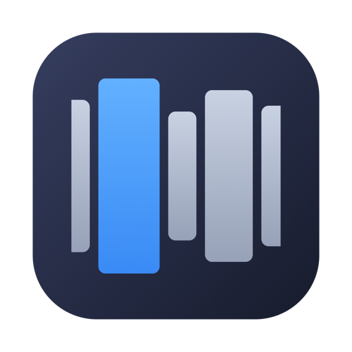

# ScrollWM

<p align="center">
  
</p>

A scrolling window manager for macOS. Windows live in columns on a horizontal
strip (PaperWM-style); navigation teleports the viewport instantly.

**One permission: Accessibility.** No Screen Recording, no Input Monitoring,
no private APIs, no daemons.

## Safety contract

ScrollWM is built around a "never break the desktop" rule:

1. **Dormant by default.** Launching it does nothing to your windows.
   Management starts only when you explicitly Arrange.
2. **Exact restore.** Every window's original position and size is captured
   before the first move. Release / Quit puts everything back exactly.
3. **Crash-proof.** Original frames are persisted to
   `~/Library/Application Support/ScrollWM/restore.json` while managing.
   If ScrollWM crashes or is `kill -9`ed, the next launch restores all
   windows automatically.
4. **Panic switch.** `ctrl+opt+esc` toggles arrange/release at any time.

## Install

ScrollWM is a single menu-bar app. The one-line installer below is the
recommended path; all options land the same `ScrollWM.app` in `~/Applications`
(or `/Applications`).

### Recommended: one-line install

```bash
curl -fsSL https://raw.githubusercontent.com/1jehuang/scrollwm/main/scripts/web-install.sh | bash
```

Downloads the latest release, removes the Gatekeeper quarantine, installs to
`~/Applications`, and launches it. No sudo, nothing on your desktop is touched
until you click Arrange. Re-run the same command anytime to update.

<details>
<summary>Other ways to install</summary>

**Homebrew**

```bash
brew install --cask 1jehuang/scrollwm/scrollwm
```

(That auto-taps this repo. If you prefer to tap first:
`brew tap 1jehuang/scrollwm https://github.com/1jehuang/scrollwm` then
`brew install --cask scrollwm`.)

**Download the app**

Grab `ScrollWM-<version>.dmg` (or `.zip`) from the
[latest release](https://github.com/1jehuang/scrollwm/releases/latest), drag
**ScrollWM.app** to Applications, then open it.

> **First open of a downloaded build:** the app is ad-hoc signed (not
> notarized), so macOS may say it "cannot be opened." Right-click the app →
> **Open** → **Open**, just once. (The curl and Homebrew installs above handle
> this for you.)

</details>

### First launch

ScrollWM shows a one-step onboarding window explaining its single permission and
opens the right Settings pane for you. Flip the **Accessibility** switch for
ScrollWM and the app continues automatically — no relaunch. If permission is
already granted, ScrollWM starts silently (it never asks when it doesn't need
to).

> Stuck? The onboarding window has a "Copy setup steps for my AI assistant"
> button that puts plain instructions on your clipboard for any assistant you
> already use. This is an optional escape hatch, never a dependency.

## Build from source

Requires Xcode (or the Swift toolchain) on macOS 14+.

```bash
git clone https://github.com/1jehuang/scrollwm
cd scrollwm
./scripts/install.sh              # build + install to ~/Applications
# or: ./scripts/install.sh --universal /Applications
```

## Updating

- Installed via curl: re-run the one-line command.
- Installed via Homebrew: `brew upgrade --cask scrollwm`.
- Built from source: `./scripts/update.sh` (rebuild, reinstall in place, relaunch).

Source builds are **ad-hoc signed** by default, so macOS sees each rebuild as a
new app and drops the Accessibility grant. To keep the permission across local
rebuilds, create a stable self-signed identity **once**:

```bash
./scripts/setup-signing.sh      # one-time: makes a local code-signing cert
./scripts/update.sh             # now installs signed with the stable identity
```

After granting Accessibility one more time post-setup, future `update.sh` runs
keep the permission (the app's signing identity no longer changes per build).

> If you have an Apple **Developer ID Application** certificate installed, the
> scripts prefer it automatically (over the self-signed cert and ad-hoc): local
> installs are then signed with the same identity used for notarized releases,
> so the Accessibility grant persists and you only manage one certificate. See
> [docs/SIGNING.md](docs/SIGNING.md).

## Releasing (maintainers)

Notarized releases open with **no Gatekeeper warning**. This needs a paid Apple
Developer account and a "Developer ID Application" certificate; without one the
pipeline still works and falls back to ad-hoc (the cask strips quarantine).

```bash
make notary-setup                # one-time: guided Developer ID + notary setup
make release                     # build + sign + notarize + staple + cask
make release-publish             # ...and upload the GitHub Release (needs gh)
```

`make release` wraps `scripts/release.sh`, which runs build → notarize → cask in
order and degrades gracefully when a cert is missing. CI does the same on a `v*`
tag when the signing secrets are configured (see the comments in
`.github/workflows/release.yml`). Full setup, including the one-time
`notarytool store-credentials`, is in [docs/SIGNING.md](docs/SIGNING.md).

## Uninstall

```bash
brew uninstall --cask scrollwm                 # if installed via Homebrew
# or, for curl/source installs:
curl -fsSL https://raw.githubusercontent.com/1jehuang/scrollwm/main/scripts/uninstall.sh | bash
# add --purge to also delete ~/Library/Application Support/ScrollWM
```

Then remove ScrollWM from System Settings → Privacy & Security → Accessibility.


## Use

Default keys (all rebindable in the config file, see below):

| Control | Action |
|---|---|
| menu bar icon → Arrange | adopt current-Space windows into the strip |
| `⌃⌥←` / `⌃⌥→` | focus previous/next column |
| `⌃⌥1`..`⌃⌥9` | jump to column N |
| `⌘H` / `⌘L` | focus left / right column |
| `⌘⇧H` / `⌘⇧L` | move focused column left / right |
| `⌥1`..`⌥4` or `⌘1`..`⌘4` | set focused column width to 25% / 50% / 75% / 100% |
| `⌘Q` | close focused window |
| `⌃⌥esc` | toggle arrange/release |
| menu bar icon → window | jump to that window |
| menu → How to Use ScrollWM… | open the in-app tutorial |
| menu → Release | restore all windows, go dormant |
| menu → Quit | restore all windows and exit |

A first run pops the tutorial automatically. The width/focus/move/close keys
are **only active while managing**, and are torn down on Release so the desktop
behaves normally (`⌘Q` quits apps, `⌘H` hides them) when ScrollWM is dormant.

## Command line (`scrollwm`)

ScrollWM ships a CLI that drives the **running** app from your shell or scripts
(installed on your PATH by Homebrew and `install.sh`). The app must be running;
`arrange`/`toggle` will launch it for you if it isn't.

```bash
scrollwm arrange                 # adopt current-Space windows into the strip
scrollwm release                 # restore all windows, go dormant
scrollwm toggle                  # arrange <-> release
scrollwm focus next|prev|3       # change focused column (3 is 1-based)
scrollwm move left|right         # move the focused column within the strip
scrollwm width 25|50|75|100      # resize focused column (also accepts 0.0-1.0)
scrollwm close                   # close the focused window
scrollwm focus-mode fit|centered # how the viewport follows focus
scrollwm reload                  # re-read the config file live
scrollwm status                  # JSON snapshot of the strip
scrollwm quit                    # restore windows and quit the app
scrollwm --help                  # full list
```

`status` prints JSON so you can script against it:

```bash
scrollwm status | jq '.windowCount, .columns[].title'
```

Every verb exits non-zero on error (e.g. not running, or not managing yet), so
it composes cleanly in scripts. Under the hood the CLI talks to the app over a
per-user Unix socket at `~/Library/Application Support/ScrollWM/control.sock` —
no network, no extra permission.

## Settings & keybindings (config file only)

All settings live in one human-editable file (the single source of truth):

```
~/Library/Application Support/ScrollWM/config.json
```

It's commented JSON. Open it from the menu (**Open Config File**), edit it, then
choose **Reload Config** — changes apply live, no relaunch. You can set the
column gap, minimum column width, width presets, focus mode (`fit`/`centered`),
and every keybinding.

> **Keybinding channels.** Always-on keys (navigation, jump, arrange/release
> toggle) use permission-free Carbon global hotkeys, which cannot capture `⌘H`
> or `⌘M` (macOS reserves them; verified via `WindowLab hotkeyprobe`). The
> while-managing keys (focus/move/width/close) ride a keyboard `CGEventTap`,
> which works with the Accessibility permission the app already holds (verified
> via `keytapprobe`) and can bind any chord, including `⌘H`/`⌘L`. No Input
> Monitoring permission is required. The default config documents this inline.

The menu bar icon is a live mini-map: columns are windows, the outline is
your viewport, blue is the focused window.

## Architecture

```
Sources/WindowLab/
  AXSource.swift             timeout-protected Accessibility wrapper
  AccessibilityPermission.swift  single source of truth for the AX grant
  OnboardingWindow.swift     first-run permission onboarding UI
  Config.swift               config file (settings + rebindable keys)
  TutorialWindow.swift       in-app tutorial / cheat sheet (config-driven)
  CGWindowSource.swift       WindowServer enumeration (CGWindowList)
  IdentityMatcher.swift      AX<->CG window fusion (PID+frame+title scoring)
  TeleportEngine.swift       strip layout, viewport, prioritized commits
  LifecycleMonitor.swift     adopt new / drop closed windows (notif + poll)
  RestoreStore.swift         crash-recovery frame persistence
  ScrollWMApp.swift          production app: controller, menu bar, signals
  Hotkeys.swift              Carbon global hotkeys (permission-free)
  MenuBar.swift              lab-mode mini-map status item
  ...benchmarks              measurement harness (see below)
```

### The lab

`WindowLab` doubles as a measurement harness. Every architectural decision
in this repo was validated against measured numbers on real hardware:

```bash
swift build
.build/debug/WindowLab probe -v        # enumerate + match windows, latency
.build/debug/WindowLab bench           # AX move/resize cost per window
.build/debug/WindowLab scrollbench 16 60 --spawn   # real-window animation jank
.build/debug/WindowLab pan 10 8 --spawn --selftest # scroll-driven panning
.build/debug/WindowLab overlay 8 --selftest        # Metal overlay + event tap
.build/debug/WindowLab capturebench 5  # SCK capture latency (needs Screen Rec)
.build/debug/WindowLab teleport --spawn --selftest # teleport tier e2e
.build/debug/WindowLab run --selftest  # production round trip
.build/debug/WindowLab run --crashtest # crash phase (then relaunch to recover)
```

Measured on M-series MacBook (macOS 26):

| Operation | p50 | p95 |
|---|---|---|
| AX move window | 0.4 ms | 0.6 ms |
| Full-strip teleport (8 windows) | 3.4 ms | 5.0 ms |
| 16 real windows animated @60Hz | 4.0 ms/tick | 8.0 ms (budget 16.7) |
| SCK capture age | 0.5 ms | 0.9 ms |
| IOSurface→MTLTexture | 0.01 ms | 0.05 ms |

### Roadmap tiers

- **Tier 0 (this app): teleport.** Accessibility only. Instant navigation.
- **Tier 1: smooth pan.** + Input Monitoring (scroll event tap). Real windows
  animated at 60Hz — validated viable by `scrollbench`.
- **Tier 2: cinematic.** + Screen Recording. Metal compositor scrolls live
  window textures at 120Hz (`overlay` + `capturebench` prove the budget).
